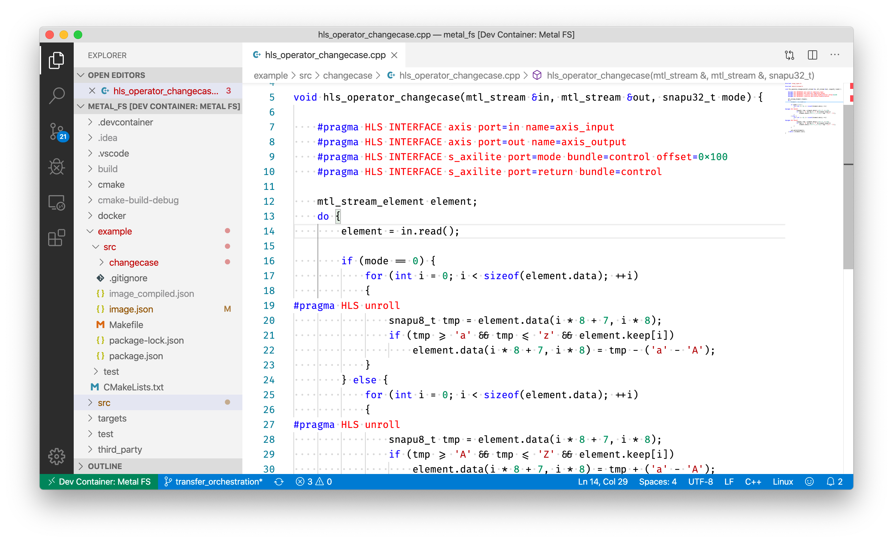

Docker-based Development Environment
====================================

Docker Images
*************

The following Docker images are stacked to provide a self-contained development environment for Metal FS Operators and Metal FS-based applications:

 - SDK (`metalfs/sdk <https://hub.docker.com/r/metalfs/sdk>`__, `Source <https://github.com/osmhpi/metal_fs/tree/master/docker/sdk>`__)
    Includes the Metal FS SDK, including precompiled binaries, for developing accelerated applications
 - SDK Base (`metalfs/sdk-base <https://hub.docker.com/r/metalfs/sdk-base>`__, `Source <https://github.com/osmhpi/metal_fs/tree/master/docker/sdk-base>`__)
    Prerequisites for Metal FS (useful for development of the project)
 - Xilinx Vivado (`metalfs/xilinx-vivado <https://hub.docker.com/r/metalfs/xilinx-vivado>`__, `Source <https://github.com/osmhpi/metal_fs/tree/master/docker/xilinx-vivado>`__)
    Includes an installation of Vivado with FPGAs supported by SNAP

Visual Studio Code Development Container
****************************************

Using a plugin for the VS Code Editor, source code can be edited through a Docker container that has additional software installed, in this case the prerequisites listed above.
Create `devcontainer.json <https://github.com/metalfs/getting-started/tree/master/.devcontainer/devcontainer.json>`__ and `docker-compose.yml <https://github.com/metalfs/getting-started/tree/master/.devcontainer/docker-compose.yml>`__ files in your repository to get started.

Docker Compose
**************

You can also use the ``docker-compose.yml`` to spin up a development container without using VS Code.

.. code-block:: bash

   docker-compose -f .devcontainer/docker-compose.yml up -d
   docker-compose -f .devcontainer/docker-compose.yml exec metalfs-dev bash

X11-Forwarding
**************

If you are using a non-Linux host and want to start Vivado X11 applications from the container, please change the DISPLAY environment variable parameter to ``"DISPLAY=host.docker.internal:0.0"`` in ``.devcontainer/docker-compose.yml``.

Allow Docker containers to connect to your X11 server:

 - Linux: run ``xhost local:root`` (`Source <https://stackoverflow.com/a/43016704/5831785>`__)
 - Docker for Mac: Enable "Allow connections from network clients" in the XQuartz settings, then run ``xhost + 127.0.0.1`` (`Source <https://medium.com/@mreichelt/how-to-show-x11-windows-within-docker-on-mac-50759f4b65cb>`__)
 - Windows: Start VcXsrv with "Multiple Windows",  Display number 0 and "Disable access control" (`Source <https://dev.to/darksmile92/run-gui-app-in-linux-docker-container-on-windows-host-4kde>`__)

FUSE in Docker
**************

Vivado HLS Debugging in Docker
******************************
